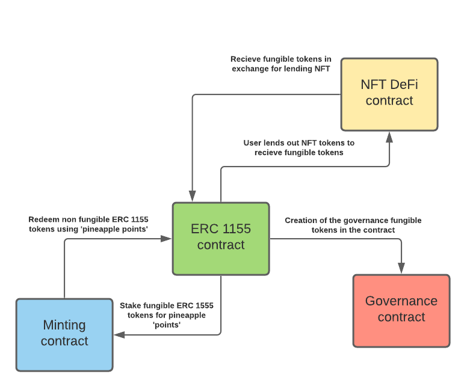

# Minecraft-NFT-Server
A Minecraft server world where players can buy and sell virtual land, items and other cosmetic goods, and build a thriving in game economy.

## Goals
- Create a NFT based ecosystem based on an open world game.
- Using a popular game like minecraft to tap into gaming audiences, younger and older alike, to introduce them to Sperax.
- Implementing a DAO like governance of the server to allow for better community management.
- Creating a functioning virtual economy based on a Sperax powered fungible token, allowing players to trade in game virtual currency for Sperax coins.
- Implementing a unique system of “lending” NFT items by putting up collateral fungible tokens with a DeFi based model.

## Project Structure
``` bash
.
├── README.md
├── front-end
├── smart-contracts
│   ├── DeFi.sol
│   ├── ERC1155.sol
│   ├── Governance.sol
│   └── Minting.sol
└── tests
```
## Components
#### NFTs
The NFTs used for this project would be a custom set of tools, weapons, armor, and cosmetic items that would be unobtainable in normal minecraft gameplay, which could be then traded, bought or sold.

#### Economy
The Project aims to have a self-regulated economy where the players would really decide the value of a certain Non Fungible token in terms of the virtual currency. Having this economy could introduce specialization on the server, where players could offer their minecraft skills in exchange for the fungible tokens

#### DeFi
DeFi is one of the hot topics in the blockchain space right now, and the project aims to integrate NFT based DeFi lending within this Minecraft Server economy. Basically, players can "lend" their NFT tokens to other players on putting up a collateral, in exchange for a small amount of interest.

#### Staking
The project aims to add a staking mechanism where players would be able to stake their fungible tokens to earn something like the MEME Project's pineapple points, which would be used to redeem NFT tokens.

#### Governance
The projects wishes to emulate a DAO like structure where players can control the decisions taken by the project by voting on proposed updates via a governance token. The top 100 owners of governance tokens would be allowed to add proposals, and community members holding governance tokens (earned by partipiating in minting and DeFi) would quadratically vote on them.

## Smart Contracts



#### ERC1155.sol
This contract will create the Non Fungible and Fungible Assets of this project, which would then be available to the other smart-contracts that are a part of the project. It will also be responsible for the creation of the porject's governance token.

#### Minting.sol
This contract will allow users to stake their fungible in game tokens in order to mint NFT tokens for in-game items/land. This smart contract would be similar to MEME wherein the user will earn something like ‘pineapple points’ and at a set number of pineapple tokens, he/she can redeem those for an NFT token.

#### DeFi.sol
This contract would be a peer-to-peer lending contract where a lender will lend his/her NFT token at a price he/she sees fit, and this NFT token will be kept in an escrow. The borrower will have access to the token but would have to pay a certain interest in order to retain access to this token. In the event that the borrower is unable to pay interest, the NFT will be transferred back to the lender.

#### Governance.sol
The governance smart contract will be similar to a DAO smart contract allowing governance token holders to vote on a proposal proposed by one of the top 100 governance token holders, and vote on the direction the community takes. The voting would be such that the amount of value assigned to a vote of a governance token older would be the square root of the amount of tokens held by him/her, thereby reducing the influence of whales on the vote.

## Contribution
Thank you for considering to help out with the source code! We welcome contributions from anyone on the internet, and are grateful for even the smallest of fixes!

If you'd like to contribute to this project, please fork, fix, commit and send a pull request for the maintainers to review and merge into the main code base.

## License
This code is licensed under the [GNU Lesser General Public License v3.0](https://www.gnu.org/licenses/lgpl-3.0.en.html).